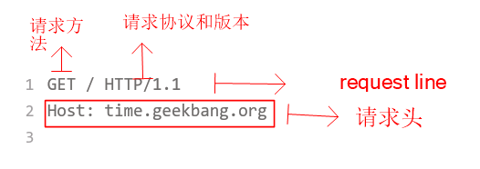
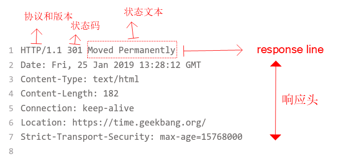
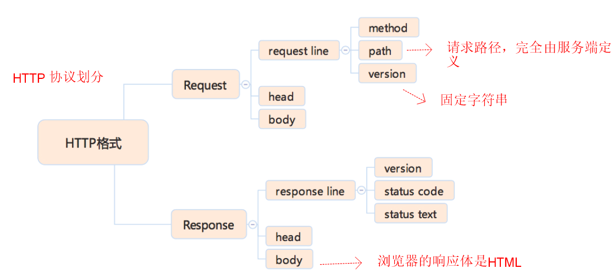

# 浏览器工作原理

1. **浏览器工作过程**
   1. 浏览器首先使用 HTTP 协议或者 HTTPS 协议，向服务端请求页面；
   2. 把请求回来的 HTML 代码经过解析，构建成 DOM 树；
   3. 计算 DOM 树上的 CSS 属性；
   4. 最后根据 CSS 属性对元素逐个进行渲染，得到内存中的位图；
   5. 一个可选的步骤是对位图进行合成，这会极大地增加后续绘制的速度；
   6. 合成之后，再绘制到界面上。
2. **HTTP 协议**：基于`TCP`协议出现，在此基础上，规定了 Request-Response 模式。这个模式决定了通讯必然是由浏览器端首先发起的。HTTP 是纯粹的文本协议，它是规定了使用 TCP 协议来传输文本格式的一个应用层协议。
3. **完整 HTTP 请求**：
   1. 请求： 分为三个部分，请求方法，请求路径和请求协议和版本
      
   2. 响应，在头之后，以一个空行作为分隔，之后是响应体
      
      
4. **HTTP 协议格式**
   
5. **HTTP 方法**
   - `GET` 浏览器通过地址栏访问都是 GET 方法
   - `POST` 表单提交产生
   - `HEAD` 和 GET 类似 ，只返回请求头。
   - `PUT`添加资源
   - `DELETE` 删除资源
   - `CONNECT` 多用于 HTTPS 和 WebSocket
   - `OPTIONS`和`TRACE` 一般用于调试，多数线上服务都不支持。
6. **常见 HTTP 状态码**
   - 1xx: 临时回应，表示客户端请继续，一般被浏览器 HTTP 库直接处理。
   - 2xx: 请求成功。 + 200： 请求成功
   - 3xx： 表示请求的目标有变化，希望客户端进一步处理。 + 301&302 ：永久性与临时性跳转。 + 304：客户端缓存没有更新
   - 4xx： 客户端请求错误 + 403： 无权限 + 404： 请求页面不存在 + 418： 这是一个彩蛋
   - 5xx： 服务端请求错误 + 500： 服务端错误 + 503： 服务端暂时性错误，可稍后再试。
7. **Request Head**
   
8. **Response Body**
   
9. **Request Body**常见格式：
   - `application/json`
   - `application/x-www-form-urlencoded`
   - `multipart/form-data`
   - `text/xml`
10. `HTTPS`两个作用：一是确定请求的目标服务端身份，二是保证传输的数据不会被网络中间节点窃听或篡改。
11. **HTTP 2.0 最大的亮点改进**：一是支持服务端推送，二是支持`TCP`连接复用。
12. **服务端推送**能够在客户端发送第一个请求到服务端时，提前把一部分内容推送给客户端，放入缓存当中，这可以避免客户端请求顺序带来的并行度不高，从而导致的性能问题。
13. **TCP 连接复用**，则使用同一个 TCP 连接来传输多个 HTTP 请求，避免了 TCP 连接建立时的三次握手开销，和初建 TCP 连接时传输窗口小的问题。
