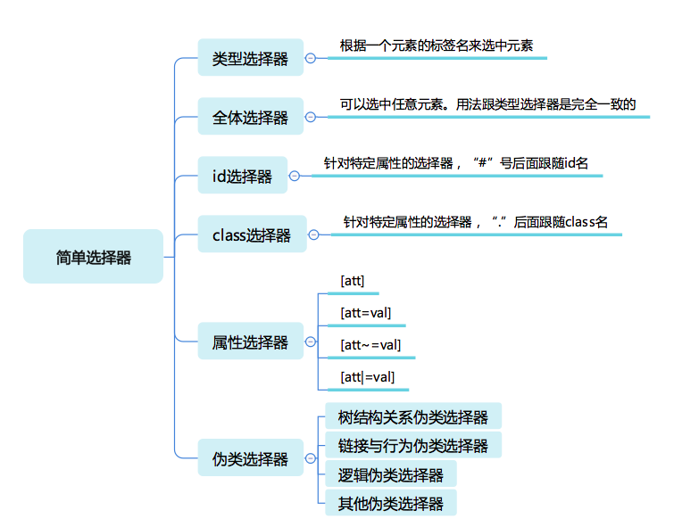

# CSS 选择器

[toc]

## 选择器

**基本意义**： 根据一些特征，选中元素树中的一批元素。

### 结构分类（由简单到复杂）

1. **简单选择器**： 针对某一特征判断是否选中元素
2. **复合选择器**： 连续写在一起的简单选择器，针对元素自身特征选择单个元素。
3. **复杂选择器**：由 "(空格)",">"，“~”，“+” “||” 等符号连接的复合选择器，根据父元素或者前序元素检查单个元素。
4. **选择器列表**：由逗号分隔的复杂选择器，表示“或”的关系。

### 简单选择器

#### 常见的简单选择器



#### 类型选择器和全体选择器

**类型选择器：**根据一个元素的标签名来选中元素。
**全体选择器**："`*`"，可以选中任意元素

##### 带命名空间的类型选择器

示例：区分选择 svg 中的 a 和 html 中的 a

```css
@namespace svg url(http://www.w3.org/2000/svg);
@namespace html url(http://www.w3.org/1999/xhtml);
svg|a {
  stroke: blue;
  stroke-width: 1;
}

html|a {
  font-size: 40px;
}
```

#### id 选择器和 class 选择器

都是针对特定属性的选择器
**id 选择器**是 "#"后面跟随 id 名
**class 选择器**是"." 后跟随 class 名,它识别的是用空格分隔的 class 语法

##### 基本用法

```css
#myid {
  stroke: blue;
  stroke-width: 1;
}

.mycls {
  font-size: 40px;
}
```

#### 属性选择器

根据 HTML 元素的属性来选中元素。

##### 四种形态

1. **[att]** 元素是否具有这个属性，有就被选中
2. **[att=val]** 精确匹配，元素的属性值是否为 val
3. **[att~=val]** 多种匹配，元素的值是否为若干值之一
4. **[att|=val]** 开头匹配，元素的值是否以 val 开头

##### 针对含有特殊字符的属性

使用 val 用引号括起来，或者使用反斜杠转义

#### 伪类选择器

一系列 css 规定好的选择器，以`:`开头，可以分为**普通型**和**函数型**两种。

##### 树结构关系伪类

- `:root` 树的根元素
- `:empty`没有子节点的元素，有个例外就是子节点为空白文本节点的情况
- `:nth-child`和`:nth-last-child`表示从前往后数第几个子节点和从后往前数第几个子节点 两个函数型伪类，用法如下：
  
- `:first-child`和`:last-child`表示第一个和最后一个元素
- `:only-child` 表示选中唯一一个子元素
- `:nth-of-type`表示从前往后数第 n 个指定类型的元素，这种写法就是一个变形的语法糖，比如 S:nth-of-type(An+b) 是 :nth-child(|An)
- 其他：`nth-last-of-type`,`first-of-type`,`last-of-type`,`only-of-type`

##### 链接与行为伪类选择器

- `:any-link` 表示任意链接
- `:link`未访问过的元素
- `:visited` 已经访问过的链接
- `:hover` 鼠标悬停在上的元素
- `:visited` 用户正在激活这个元素
- `:focus` 焦点落在这个元素之上
- `:target`用于访问选中浏览器 URL 的 hash 部分所指示的元素

在 Selector Level 4 草案中，还引入了 target-within、focus-within 等伪类，用于表示 target 或者 focus 的父容器。

##### 逻辑伪类选择器

- `:not` 选中内部的简单选择器没有命中的元素，现阶段只支持简单选择器。
  用法：

```css
*|*: not(: hover);
```

在 Selector Level 4 草案中，还引入了`:is`,`:where`,`:has`等 逻辑伪类。

##### 其他伪类选择器

- 国际化：用于处理国际化和多语言问题 + dir + lang
- 音频/视频：用于区分音频播放状态 + play + pause
- 时序：用于配合读屏软件等时序性客户端的伪类 + current + past + future
- 表格：用于处理 table 的列的伪类 + nth-col + nth-last-col

##### 伪类使用建议

尽量通过合适的 id 和 class 来标识元素，最好只在不得不使用伪类的情况下使用
