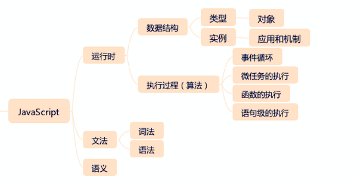
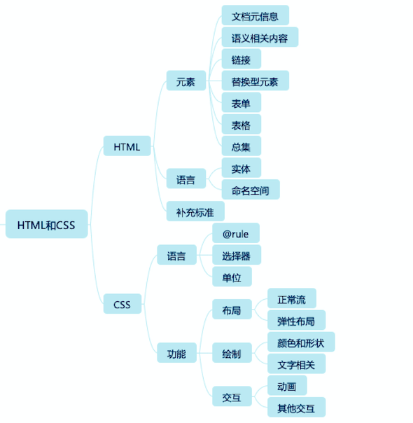
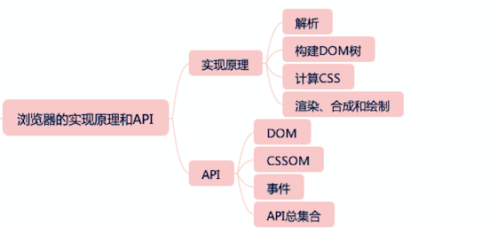
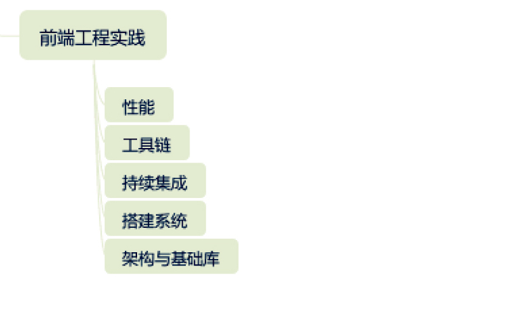

# 前端知识架构图

1. **课程的目标**：一是把无法查阅的原理和背景讲清楚，二是 整理好不方便查阅和记忆的知识。
2. **JavaScript 架构图**
   
3. **HTML 与 CSS 架构图**
   

   - **元信息类标签**： `head`里面的标签，诸如`title`，`meta`等，用于描述文档的基本信息。
   - **语义类标签** 诸如`section`，`nav`的标签，视觉表现和`div`没有区别，但是有其各自使用场景。
   - **替换性媒体标签**： 用于引入外部内容，比如`img`,`video`等。
   - **表单**：用于填写和提交信息，例如`input`,`button`等。
   - **表格** : 表头，表尾，单元格等结构。

4. 浏览器原理架构  
   

5. 前端工程实践
   
