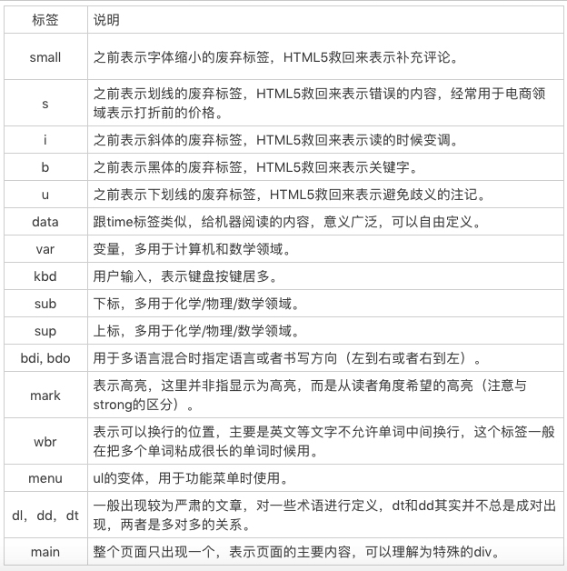

# 运用语义类标签来呈现`wiki`网页

1. `aside` 导航性质的工具内容。
2. `article` 主题本分有明确的独立性。
3. 标题类：`hgroup` 标题组，`h1`-`h6`分别是一到六级标题。
4. `abbr` 表示缩写。
5. `hr` 表示故事走向的转变或者话题的转变。纯视觉效果不要用`hr`,使用`css`的`border`。
6. `strong`表示强调语气。
7. 引述相关
   - `blockquote` 表示段落级引述内容
   - `q`表示行内引述内容
   - `cite`表示引述的作品名
8. `time`标签表示日期，用于让机器阅读。
9. `figure` 用于表示与文章相关的图像、照片等内容。`figcaption`表示内容的标题。
10. `dfn`标签用来包裹被定义的内容。
11. `pre`标签用来包裹预先排版过的内容。`samp`标签表示计算机程序的示例输出。`code`标签包裹代码。
12. 其他
    
