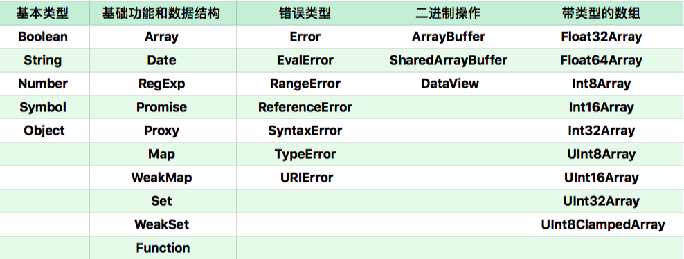

# `JavaScript对象`：全部对象分类

1. `JavaScript`中的对象可以分为两类：
   1. **宿主对象**：由`JavaScript`宿主环境提供的对象，行为完全由宿主环境决定。
   2. **内置对象**：有`JavaScript`语言提供的对象。
2. **内置对象分类**：可分为以下几类
   1. **固有对象**：由标准规定，随着`JavaScript`运行时创建而自动创建的
   2. **原生对象**： 可以由用户通过`Array`等内置构造器或者特殊语法创建的对象。
   3. **普通对象**：由`{}`语法、`Object`构造器或者`class`关键字定义类创建的对象，**能够被原型继承**。
3. **浏览器环境中的宿主对象**：浏览器环境中的全局对象`window`上的属性，一部分来自`JavaScript`语言，一部分来自浏览量器环境。也可以分为**固有的**和**用户创建的**两种。比如`document.createElement`就可以创建一些`dom`对象。
4. **内置对象-固有对象**：在`js`代码执行前就已经被创建出来了。（[固有对象表](https://www.ecma-international.org/ecma-262/9.0/index.html#sec-well-known-intrinsic-objects)）
5. **内置对象-原生对象**
   
6. **无法继承原生对象原因：**原生构造器创建的对象多数使用了私有字段，这些字段使得原型继承方法无法正常工作。
7. 宿主和内置对象在被作为函数调用和作为构造器使用时不一定一致：
   1. `Date`作为构造器调用产生新的对象，作为函数调用，返回字符串。
   2. 有些构造器不能作为函数调用，比如`Image`
   3. 基本类型（`String`，`Number`,`Boolean`）的构造器被当做函数调用，则产生类型转换的效果。
   4. 对用`function`语法或者`Function`构造器创建的对象来说，函数调用和构造器调用的行为是相似的，总是执行同一段代码。
8. **构造器的执行过程**：
   - 以`Object.prototype`为原型创建一个新对象
   - 以新对象为`this`，指向函数的`[[call]]`
   - 如果`[[call]]`的返回值是对象，那么，返回这个对象，否则返回第一步新创建的对象。
9. **特殊行为的对象：**
   - `Array`： `Array`的`length`属性根据最大的下标自动发生变化。
   - `Object.prototype` 作为所有正常对象的默认原型，不能再给它设置原型了。
   - `String`： 为了支持下标运算，`String`的正整数属性访问会去字符串里查找。
   - `Arguments`：`arguments` 的非负整数型下标属性跟对应的变量联动。
   - 模块的 `namespace` 对象：特殊的地方非常多，跟一般对象完全不一样，尽量只用于 `import`吧。
   - 类型数组和数组缓冲区：跟内存块相关联，下标运算比较特殊。
   - `bind` 后的 `function`：跟原来的函数相关联。
10. **全局对象的属性**
    三个值：`Infinity`、`NaN`、`undefined`
    九个函数：`eval`, `isFinite`, `isNaN` ,`parseFloat`,`parseInt`,`decodeURI`,`decodeURIComponent`,` encodeURI``encodeURIComponent `
    构造器：`Array`、`Date`、`RegExp`、`Promise`、`Proxy`、`Map`、`WeakMap`、`Set`、`WeapSet`、`Function`、
    `Boolean`、`String`、`Number`、`Symbol`、`Object`、`Error`、`EvalError`、`RangeError`、
    `ReferenceError`、`SyntaxError`、`TypeError`
    `URIError`、`ArrayBuffer`、`SharedArrayBuffer`、`DataView`、`Typed Array`、`Float32Array`、
    `Float64Array`、`Int8Array`、`Int16Array`、`Int32Array`、`UInt8Array`、`UInt16Array`、
    `UInt32Array`、`UInt8ClampedArray`。
    四个用于当做命名空间的对象：`Atomics`,`JSON`,`Math`,`Reflect`
