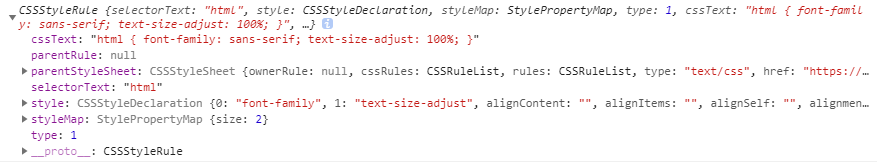
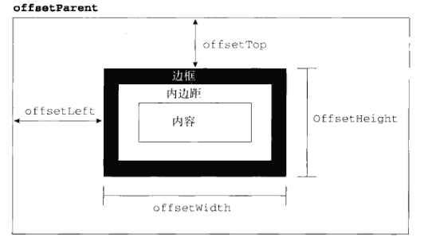

# 12 `DOM2`和`DOM3`

## DOM 变化

`DOM`变化的目的在于扩展`DOM API`，以满足操作`xml`的所有需求。

### 与`xml`相关变化

### 与`xml`无关的其他变化

1. `documentType`变化，新增`3`个属性：`publicId`，`systemId`和`interalSubset`，前两个属性表示文档类型声明的两个行西段，第三个用于访问包含在文档类型声明中的额外定义，如果不存在则是`undefined`。
2. `Document`类型变化

   - 属性： + `defaultView`指向拥有给定文档的窗口，在`IE`中存在等价属性名`parentWindow`
   - 方法 + `importNode()` 从文档中取得节点，导入到另一文档，接收参数
   - 针对`document.implementation`对象的变化，增加方法 + `createDocumentType()`创建一个新的`DocumentType`节点 + `createDocument()`创建一个新文档 + `createHTMLDocument()`创建一个完整的`HTML`文档

3. `Node`类型变化
   `isSupported()`检测当前节点的能力
   `isSameNode()`二者引用同一节点返回`true`
   `isEqualNode()`两个节点相同类型，相同属性则返回`true`

   `setUserData()`将数据执行给节点

   ```javascript
   document.body.setUserData("name", "zhaosi", function() {});
   ```

   `getUserData()`返回节点数据

   var value = document.body.getUserData('name');

4. 框架变化
   框架和内嵌框架分别用`HTMLFrameElement`和`HTMLIFrameElement`表示，二者均有一个属性`contentDocument`，指向表示框架内容的文档对象。

## 样式

### 元素样式`style`对象

任何支持`style`特性的`HTML`元素都有一个对应的`style`属性，包含着通过元素`style`特性制定的样式信息。注意：不包含外部样式和嵌入样式。在`style`特性中的任何`css`属性都将表现为该`style`对象的对应属性。对于使用"-"分割的属性，需要将其转换为驼峰大小写形式。其中有一些特殊情况，比如说`float`对应属性名是`cssFloat`。也可以通过该对象为元素设置样式。

```htmlbars
<body style="background-color:red"></body>
<script>
	document.body.style.backgroundColor; //"red"
	document.body.style.color = 'white';
</script>
```

#### `style`对象属性和方法

- `cssText`：访问`css`代码
- `length`：属性数量
- `parentRule`：表示`css`信息的`CSSRule`对象
- `item(index)`: 指定位置的`css`属性名称
- `getPropertyCSSValue(propertyName)`给定属性值得`CSSValue`对象
- `getPropetyPriorty(propertyName)`：如果属性是否使用了`!important`设置，返回`important`
- `getPropertyValue(propertyName)`：给定属性的字符串
- `removeProperty(propertyName)`: 删除给定属性
- `setProperty(propertName, value, priorty)`设置给定属性

**`CSSValue`**对象属性

- `cssText`属性值
- `cssValueType`属性类型，`0`表示继承，`1`表示基本值，`2`表示值列表，`3`表示自定义

#### 计算样式

`getComputedStyle(element,"伪元素字符串")`：返回元素的计算样式
在`IE`中，元素的`currentStyle`属性包含元素全部计算后的样式。

### 操作样式表

#### `StyleSheet`类型

包含以下属性：

- `disabled`：样式表是否禁用，可写值。
- `href`：如果是通过`<link>`包含，则是其`url`，否则为`null`
- `media` 可支持所有媒体类型
- `ownerMode`：指向当前有样式表的节点的指针，可能是`style`或`link`元素，如果通过`@import`导入则为`null`。
- `parentStyleSheet`:当前样式表是通过`@import`导入时，指向导入样式表的指针。
- `title`: `ownerNode`的`title`属性值。
- `type`：样式类型，对于`css`样式表，该值为`text/css`。

#### `CSSSstyleSheet`类型

该类型继承自`StyleSheet`类型。除了支持父类的所有属性外，还支持以下属性

- `cssRules`：样式表中包含的所有样式规则的集合
- `ownerRule`：当前样式表如果是通过`@import`导入时，指向导入样式表的指针，否则为`null`
- 操作方法： + `deleteRule(index)`删除执行位置的规则，在`IE`中使用`removeRule()` + `insertRule(rule,index)`在指定位置插入样式，在`IE`中使用`addRule()`

#### `CSSStyle`类型

##### 示例



##### 属性

- `selectorText`选择符文本
- `cssText`：`css`规则文本
- `parentRule：`如果是导入规则，指向导入规则
- `parentStyleSheet`:所属样式表
- `style` 对应的`CSSRuleDeclaration`对象，可用于设置和取得规则的样式值。
- `type`规则类型常量，在这里值为`1`

#### 创建规则（跨浏览器）

```javascript
function insertRule(sheet, selectorText, cssText, position) {
  if (sheet.insertRule) {
    sheet.insertRule(selectorText + "{" + cssText + "}", position);
  } else if (sheet.addRule) {
    sheet.addRule(selectorText, cssText, position);
  }
}
```

#### 删除规则（跨浏览器）

```javascript
function deleteRule(sheet, index) {
  if (sheet.deleteRule) {
    sheet.deleteRule(index);
  } else if (sheet.removeRule) {
    sheet.removeRule(index);
  }
}
```

### 元素大小

#### 偏移量

##### 属性

- `offsetHeight`，元素在垂直方向上占用空间大小，包括元素高度、水平滚动条高度及上下边框高度。
- `offsetWidth`元素在水平方向上占用空间大小， 包括元素宽度、垂直滚动条宽度及左右边框宽度。
- `offsetLeft` 元素左外边框到父元素的左内边框之间的距离
- `offsetTop` 元素上外边框到其父元素的上内边框之间的距离

##### 图示



##### 计算元素在当前页面的偏移量

**原理**：通过`offsetParent`属性逐层向上回溯，将每个层次的偏移量计算到一起。

```javascript
function getElementLeft(element) {
  var actualLeft = element.offsetLeft;
  var current = element.offsetParent;

  while (current !== null) {
    actualLeft += current.offsetLeft;
    current = current.offsetParent;
  }

  return actualLeft;
}
```

#### 客户区大小

**含义**：指的是元素内容及其内边距所占据的空间大小，也就是说元素内部空间大小。

##### 属性

- `clientWidth` 元素内容宽度加上左右内边距
- `clientHeight` 元素内容高度加上上下内边距

##### 图示


#### 滚动大小

**含义**：包含滚动内容的元素的大小。

##### 属性

- `scrollHeight`: 没有滚动条时，元素内容的总高度
- `scrollWidth`: 没有滚动条时，元素内容的总宽度
- `scrollLeft`: 被隐藏在内容区域左侧的像素数，可以通过设置该值来改变元素的滚动位置。
- `scrollWidth`: 被隐藏在内容区域上方的元素数，可以通过设置该值来改变元素的滚动位置。

##### 图示


#### 确定元素大小的方法

`getBoundingClientRect()`返回一个矩形对象，包括`left`,`top`,`bottom`,`right`4 个属性。
