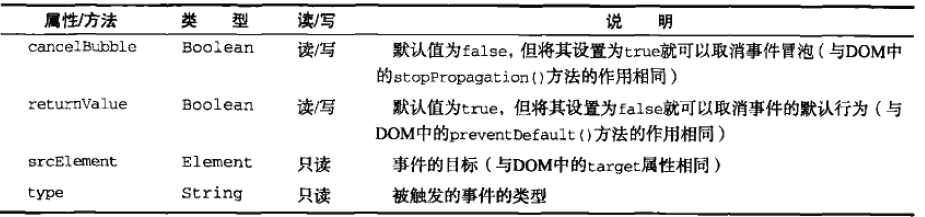

# 13.事件

[toc]

## 13.1 事件流

**定义**：从页面中接受事件的顺序。`IE`的事件流是冒泡流，而`Netscape`是事件捕获流。

**事件冒泡**：由最具体的元素接收，逐渐向上传播到最不具体的元素。
**事件捕获**：不太具体的元素先接收到事件，而最具体的节点应该最后接收到事件。
**DOM 事件流**包括**三**个阶段，事件捕获阶段，处于目标阶段和事件冒泡阶段。

## 13.2 事件处理程序

### 概念

**事件**：用户或者浏览器自身执行的某种动作。
**事件处理程序**：响应某个事件的函数，也叫作**事件侦听器**。

### `HTML`事件处理程序

`HTML`事件处理程序，定义时可以包含具体要执行的代码，或者调用页面其他地方调用的脚本。这个函数内部，`this`值等于事件的目标元素。

```javascript
<button id="btn" click="alert('click')">
  click me
</button>
```

**缺点**：

1. 可能由于脚本引用顺序的时差而引发错误，例如事件处理程序中包含的函数还未载入。
2. 扩展事件处理程序的作用域链在不同浏览器中会导致不同的结果。
3. `html`与`javascript`紧密耦合，这也是摈弃`html`事件处理程序的原因。

### `DOM0`级事件处理程序

将函数赋值给一个事件处理程序。

```javascript
var btn = document.getElementById("btn");
btn.onclick = function() {
  alert("click");
};
```

**优点**：1.简单 2. 跨浏览器
**删除事件处理程序**：通过将其属性值设置为`null`

```javascript
btn.onclick = null;
```

### `DOM2`级事件处理程序

**方法：**用于处理指定和删除事件处理程序的操作：`addEventListener()`和`removeEventListener()`.

**参数：**处理时间名、事件处理程序的函数和 一个布尔值。为`true`是，表示在捕获阶段调用事件处理程序，如果为`false`,表示在冒泡阶段调用事件处理程序。

**优点**：添加多个事件处理程序。

**删除：**使用`removeEventListener()`来移除，在移除时传入的参数和添加事件处理程序使用的参数相同。通过`addEventListener()`添加的匿名函数无法移除。

**使用建议**： 最后一个参数传入 false ,也就是将事件处理程序添加到事件流的冒泡阶段，可以最大限度的兼容各种浏览器。

### IE 事件处理程序

1. **方法**: `addEvent()`和 `detachEvent()`，接收**参数**：事件处理程序名称和事件处理程序函数。事件会**被添加到事件流的冒泡阶段**。
2. **IE 中方法 与 dom 0 级方法的区别**：事件的作用域。在 **DOM 0 级**，事件处理程序会在所属元素的作用域内进行，在使用 `attachEvent()` 方法时，事件处理程序会在全局作用域中记性，因此`this` 等于 `window`
3. **优点**：可以为一个元素添加多个事件处理程序
4. **执行顺序**： 多个事件处理程序以添加顺序相反的顺序被触发。
5. **删除事件处理程序**：使用`detachEvent()`来移除，必须提供相同的参数，添加的匿名函数不能被移除。
   ##13.3 事件对象
   触发`DOM`上的某个事件时，会产生一个事件对象`event`,这个对象包含着所有与事件相关的信息。不同浏览器对事件对象的支持方式不同。

### DOM 中的事件对象

兼容 DOM 的浏览器会将一个 event 对象传入到事件处理程序中。不论指定事件的方式是 DOM0 级 还是 DOM 2 级。
**`this`，`target`，`currentTarget`三者关系**： 在事件处理程序内部，**this 始终等于 currentTarget 的值，target 则包含事件的实际目标**，如果直接将事件处理程序指定给目标元素，三者相等。
**取消默认行为：**`cancleable`属性为 true 的事件，可以通过 **preventDefault()** 方法来取消默认行为。
**取消进一步事件捕获和冒泡：**通过**stopPropagation()**来停止。
**事件流阶段**：事件对象的 eventPhase 属性，可以确定处于事件流的哪个阶段。该属性等于 1，处于捕获阶段。该属性等于 2，处于目标阶段，该属性等于 3，处于冒泡阶段。

### IE 中的事件对象

**访问 IE 事件对象的方式**：取决于指定事件处理程序的方法。

1. 使用**DOM0 级**添加事件处理程序时，**event 对象作为 window 对象的一个属性存在。**
   `javascript link.onclick = function(){ var event = window.event; };`
2. 使用**attachEvent**添加，**event 对象作为参数被传入事件处理程序**。

   ```javascript
   btn.attachEvent("onclick", funcrion(event) {
   ...
   });
   ```

3. 使用**HTML**指定，通过**event 变量来访问**

   ```htmlbars
   <input type="button" value="click me" onclick="alert(event.type)">
   ```

**属性和方法**



**取消事件默认行为**：将 returnValue 设置为 false

```javascript
link.onclick = function() {
  window.event.returnValue = false;
};
```

**取消事件冒泡**： 将`cancelBubble`设置为`true`

```javascript
window.event.cancelBubble = true;
```

## 13.2 事件类型

**一、DOM3 级规定的几类事件**

- **UI 事件**，用户与页面元素进行交互
- **焦点事件**，元素获得或失去焦点
- **鼠标事件**，使用鼠标在页面上执行操作
- **滚轮事件**，使用鼠标滚轮时触发
- **文本事件**，输入文本触发
- **键盘事件**，在键盘执行操作时触发
- **合成事件**，当输入法编辑器输入字符时触发
- **变动事件**，底层 DOM 结构发生变化触发
- ~~**变动名称事件**，元素或属性名变动时触发，已废弃~~

### UI 事件

- ~~**DOMActive：**表示元素被用户操作激活，已废弃~~
- **load**：加载完毕后触发，可能在`window`，图像，框架集等元素上触发。
- **unload**：卸载后触发。
- **abort**： 用户停止下载或没有加载完，则在元素上触发。
- **error**：发生错误时触发
- **select**： 用户选择文本框中的一个或多个字符时触发。
- **resize**: 窗口或者框架大小变化时在 window 或框架上触发。
- **scroll**： 当用户滚动带滚动条元素中的内容时触发。

#### **一、 load 事件**

**触发时机**

1. 当页面完全加载后，会触发 window 上的 load 事件。
2. 图像加载完毕
3. 在 IE9 以上，`<script>` 上可以触发
4. IE 和 Opera ，`<link>`元素可以触发

**定义 onload 的两种方式**：

1. 给 window 对象 onload 事件绑定事件处理程序，建议使用这种方式
2. 为 body 元素添加一个 onload 特性

#### **二、unload 事件**

**触发时机**：文档被完全卸载后触发。例如，切换页面就会触发 unload 事件。

**定义 onunload 的两种方式**

1. 给 window 对象的 onunload 事件添加事件处理程序，建议使用这种方式。
2. 为 body 元素添加一个 onunload 特性

#### 三、resize 事件 {#resize}

**触发：**浏览器窗口被调整到一个新的高度或宽度时触发。

**定义方式**

1. 给 window 对象的 onresize 添加
2. 给 `<body>`元素中的 onresize 特性来指定事件处理程序。

**建议：**不要在 resize 事件处理程序中加入计算量大的代码，可能导致反应变慢。

#### **四、scroll 事件**

**触发**：带滚动条元素滚动时触发

**定义方式**：同样有两种定义方式，[参考四中定义方式](#resize)

**建议**：scroll 事件在滚动期间被重复触发，需要保持事件处理程序的代码简单。

### 焦点事件

- **blur**: 失去焦点时触发，不会冒泡
- **foucus**: 元素获得焦点时触发，不冒泡
- **foucusin**: 元素获得焦点时触发，支持冒泡
- **foucusout**： 元素失去焦点时触发，是 HTML 事件 blur 的通用版本
- ~~**DOMFocusIn** 在元素获得焦点时触发，已废弃，使用 focusin 代替~~
- ~~**DOMFocusOut** 元素失去焦点时触发，已废弃，使用 foucuout 代替~~

### 鼠标和滚轮事件

- **click** 单击鼠标主按钮或按下回车时触发
- **dbclick** 双击鼠标主按钮触发
- **mousedown** 按下任意鼠标按钮触发
- **mouseenter** 光标从元素外部首次移动到元素内部时触发，但是这个事件不冒泡。
- **mouseleave** 位于元素上方的光标移动到元素范围之外时触发，不支持冒泡。
- **mousemove** 鼠标指针在元素内部移动时，重复触发。
- **mouseout** 鼠标指针从一个元素移动到另一个元素时触发。
- **mouseover** 鼠标指针元素外部首次移入另一个元素边界内触发。
- **mouseup** 鼠标按钮释放时触发。
- **mousewheel** 滚轮事件

#### **坐标：**

**客户端坐标**：表示 事件发生时鼠标指针在视口中的水平和垂直坐标，保存在事件对象的 clienX 和 clientY。
**页面坐标**： 表示事件发生时指针在页面的水平和垂直坐标，保存在事件对象的 pageX 和 pageY.
**屏幕坐标**： 事件发生时，鼠标指针相对于整个屏幕的坐标信息，保存在事件对象的 screenX 和 screenY .

**修改键：**记录修改键是否被按下，保存在事件对象的 shiftKey、ctrlKey、altKey 和 metaKey 中。包含的都是布尔值。

**相关元素**：在 mouseout 和 mouseover 事件时，涉及到光标从一个元素移动到另一个元素之内。除去目标元素的另一个元素叫做相关元素。保存在 event 对象的 relatedTarget 属性。在 IE 中则保存在 fromElement 或 toElement 属性中。

**鼠标按键指示**： 在 mousedown 和 mouseup 事件中，event 对象的 button 属性保存按下或释放的按钮。值为 0 表示主按钮，1 表示滚轮，2 表示次按钮。
**更多的事件信息**： 提供事件的更多信息，保存在 `detail`属性。如果是鼠标事件，detail 保存在给定位置 上发生单击的次数。

**IE 中提供的事件信息：** altLeft , ctrlLeft ,shiftLeft 分别表示对应按键是否被按下。offsetX 和 offsetY 代表光标相对于目标元素边界的 x,y 坐标。

#### 鼠标滚轮事件

**触发**：使用鼠标滚轮进行交互时。支持冒泡。

**`wheelDelta`属性**：向前滚动是，是 120 的倍数，向后滚动时，是-120 的倍数。在早期的 opera 中，该值的正负号是相反的。在 Firefox 中，支持一个名为 `DOMwheelScroll`的时间，有关滚轮方向的值保存在 detail 属性中。向前滚动时，该值是 -3 的倍数，向后滚动时，该值是 3 的倍数。

### 键盘与文本事件

#### 键盘事件

- **keydown** 按下**任意键**触发
- **keypress** 按下**字符键**触发，按住不放重复触发。ESC 也触发该事件。
- **keyup** 释放键盘上的键时触发。

#### 文本事件

- **textInput**：在文本插入文本框之前触发，这是对 keypress 事件的补充

#### 相关属性

- **keyCode** 与键盘某一按键对应的编码，最常用的是 enter 键对应的 keyCode 为 13。触发 keyup 和 keydown 事件时，该属性才包含值。
- **charCode** 在 keypress 事件发生时，该属性保存按下的那个键所代表的字符的 ASCII 编码。

#### DOM3 级关于键盘事件的变化

**新增属性**

- **key** 为了取代 keycode ，如果按下字符键，该值是对应字符。如果为非字符键，该值为相应键名。
- **char** 按下字符键时与 key 属性相同，按下非字符键则值为 null
- **location** 表示按下什么位置的键。
- **getModifierState()** 传入表示修改键的字符串，返回该按键是否按下的布尔值。

#### **textInput**事件

**属性**

- **data** 表示用户输入的字符
- **inputMethod** 表示文本输入到文本框中的方式

**textInput** 和 **keypress**区别

1. 触发事件的元素不同。只有可编辑区域才能触发 textInput ，但所有可获得的焦点的元素都可触发 keypress。
2. 能够触发事件的按键范围。只有实际的字符键才能触发 textInput，但影响文本显示的键就能触发 keypress，例如 ESC。

### 复合事件

- **compositionstart**： 文本系统打开时触发。
- **compositionupdate**：向输入字段插入新字符时触发。
- **compositionend** ：文本复合系统关闭时触发，表示返回正常键盘输入状态。

**IME**： 输入法编辑器，IME 通常需要同时按住多个键，但最终只输入一个字符。

**复合事件作用**： 用于处理 IME 的输入序列。

**兼容性**：IE9 是唯一支持复合事件的浏览器，因此用处不大。

#### 检测浏览器是否支持复合事件

```javascript
document.implementation.hasFeature("CompositionEvent", "3.0");
```

### 变动事件

- **DOMSubtreeModified** DOM 结构发生变化时触发，以下事件发生后均会引起该事件。
- **DOMNodeInserted** 节点作为子节点被插入到一个节点中触发，支持冒泡。
- **DOMNodeRemoved** 节点从其父节点被移除时触发，支持冒泡。
- **DOMNodeInsertedIntoDocument** 节点被直接插入文档中之后触发，该事件在 DOMNodeInserted 之后触发，不支持冒泡。
- **DOMNodeRemovedFromDocument** 节点从文档中删除后触发，该事件在 DOMNodeRemoved 之后触发，不支持冒泡。
- **DOMAttrModified** 特性被修改之后触发。
- **DOMCharacterDataModified** 文本节点的值发生变化之后触发。

#### 检测变动事件

```javascript
document.implementation.hasFeature("MutataionEvents", "2.0");
```

#### 删除节点触发事件顺序

1. 触发 DOMNodeRemoved 事件，event.target 指向被删除节点，event.relatedNode 指向目标节点父节点
2. 在目标节点及其子节点上触发 DOMNodeRemovedFromDocument 事件
3. 在目标节点的父节点上触发 DOMSubtreeModified 事件。

#### 插入节点触发的事件顺序

1. 触发 DOMNodeInserted 事件，event.target 指向被插入节点，event.relatedNode 指向目标节点父节点
2. 在新插入节点上触发 DOMNodeRemovedFromDocument 事件
3. 在新插入节点的父节点上触发 DOMSubtreeModified 事件。

### html5 事件

#### 1. **contextmenu** 事件

**用途**：表示何时应该展示上下文菜单，以便开发人员取消默认的上下文菜单而提供自定义的菜单。
**建议**：该事件支持冒泡，所以通常将事件绑定在 document 上。

#### 2. beforeunload 事件

**用途**：可以在页面卸载时阻止，将控制权交给客户。
**实现在关闭前二次确认**：将 event.returnValue 的值显示为要显示给用户的字符串，同时作为函数的值返回。

```
windown.addEventListener('beforeunload',(e) => {
	var msg = "确认离开吗？";
	event.returnValue = msg;
	return msg;
})
```

#### 3.DOMContentLoaded 事件

**触发时机**：在形成完整的 DOM 树之后就会触发，不理会外部资源是否加载完毕。
**好处**：支持在页面下载的早期添加事件处理程序，能够尽早与页面交互。
**示例**

```javascript
document.addEventListener('DOMContentLoaded',function(){
	...
})
//对不支持该事件的浏览器
setTimeout(function(){},0);
```

#### 4. readystatechange 事件

IE 为 DOM 文档中的某些部分提供了 readystatechange 事件。

**用途**：提供与文档或元素的加载状态有关的信息。

##### readystate 属性

支持 readystatechange 事件的对象都有一个 readystate 属性。可能包含下列 5 个值之一：

- **uninitialized(未初始化)** 对象存在但未初始化
- **loading（正在加载）** 对象正在加载数据
- **loaded（加载完毕）** 对象加载数据完毕
- **interactive(交互)** 可以操作对象，但还没有完全加载。
- **complete（完成）** 对象已经加载完毕

##### 使用建议

并非所有对象都有上述的几个状态，而且该属性的值不总是连续的。通常建议检测多个状态。

```
document.addEventListener('readystatechange',()=> {
	if(document.readyState === 'interactive' || document.readyState === 'complete'){
	...
	}
},false)
```

#### 5. pageshow 和 pagehide 事件

##### 往返缓存（bfcache）

**往返缓存**：将整个页面都保存在内存中。可以在用户使用“前进”和“后退”时加快页面的转换速度。
**注意**：如果页面处于 bfcache 中，将不会触发 load 事件。

##### pageshow

**触发条件**： 页面显示时触发，在 load 事件后触发
**event 中的属性**

- `persisted`：页面是否保存在 bfcache 中。
  **使用建议**： 将其事件处理程序添加到 window

```javascript
window.addEventListener("pageshow", function(event) {
  console.log("pageshow:");
  console.log(event);
});
```

##### pagehide

**触发条件** 卸载页面时触发，在 unload 事件前触发。
**使用建议**： 将其事件处理程序添加到 window

#### 6. haschange 事件

**触发条件**： url 的参数列表（及 url 中 # 后的字符串）变化时触发

**事件属性**

- `oldURL` 和 `newURL` 参数列表变化前后的的完整 url，由于兼容性问题**_不建议使用_**，最好使用 location 来确定当前的参数列表。

**检测是否支持 haschange 事件**

```javascript
var isSupported =
  "onhaschange" in window &&
  (document.documentMode === undefined || document.documentMode > 7);
```

### 设备事件

#### orientationchange 事件

这是一个 Safari 浏览器的专有事件。
**触发条件**：横向查看模式和纵向查看模式相互转换时

##### window.orientation

该属性可能包含 3 个值：

- 0 纵向查看
- 90 左旋转的横向
- -90 右旋转的横向

##### 兼容性

所有的 iOS 设备均支持该事件。

#### MozOrientation 事件

##### 触发条件

检测到设备方向改变时触发

##### 事件属性

包括 3 个属性 x,y 和 z,跟别表示不同坐标上的方向。均处于-1~1 之间。

##### 绑定到该事件的处理程序

```javascript
window.addEventListener('MozOrientation',function(event){
	...
})
```

##### 兼容性

只有带加速针的设备才支持该属性。包括 MacBook，ThinkPad 和安卓设备等。

#### deviceorientation 事件

##### 触发条件

同`MozOrientaion`事件一样，检测到设备方向改变时触发

#### devicemotion 事件

**触发条件**： 设备移动的时候

##### 事件对象属性

- `acceleration`包含 x,y,z 属性的对象，表示在不考虑重力时每个方向上的加速度
- `accelerationIncludingGravity`: 包含 x,y,z 属性对象，表示在考虑重力时每个方向上的加速度
- `interval` 以毫秒表示的时间值
- `rotationRate` 一个包含表示方向的 alpha,beta 和 gamma 属性的对象
